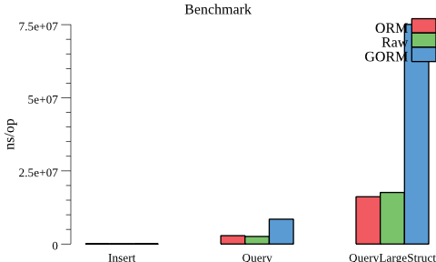

# Latest benchmark results

Units: [ns/op (ratio from ORM)]

| Test | ORM | Raw | GORM |
| --- | --- | --- | --- |
| Insert | 20804 (100%) | 14703 (70%) | 59277 (284%) |
| Query | 2727120 (100%) | 2523774 (92%) | 8470510 (310%) |
| QueryLargeStruct | 16939367 (100%) | 18189862 (107%) | 76929097 (454%) |

Benchmark time: 2018-01-27

#### Compared packages:

- [x] ORM: posener/orm (this package)
- [x] RAW: Direct SQL commands
- [x] GORM: jinzhu/gorm

#### Operations:

- [x] Insert: INSERT operations
- [X] Query: SELECT operations on an object with 2 fields
- [X] QueryLargeStruct: SELECT on an object of ~35 different fields

